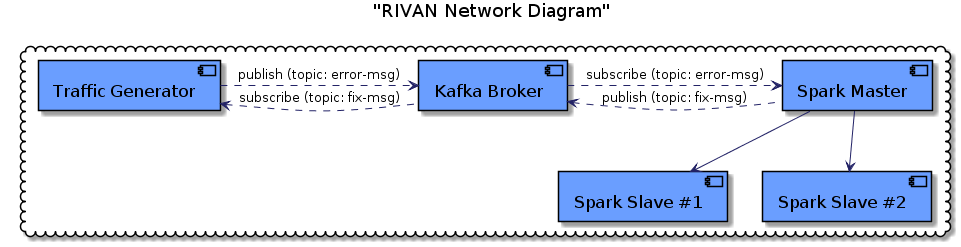

## RIVAN (Remote IoT Vulnerability Alert Network)

The goal of the RIVAN network is to provide administrators and developers of distributed IoT systems a system of tools
remotely monitor the current vulnerabilities found in their network. The RIVAN system consists of multiple simulated 
networks which simulate possible real-world vulnerability logs. These logs are collected into a centralized platform
which allows analytics and real-time alerts to the monitoring system administrators. The backend uses a scalable,
offsite-hosted approach allowing administrators to scale the number of networks monitored by scaling the backend 
resources linearly.

The RIVAN network is built on the "Google Cloud" platform and utilizes the following technologies:

1. Traffic Generator (VM #1 --- OS: Ubuntu 18.04 LTS)
    * Kafka Client ([Python Plugin](https://pypi.org/project/kafka-python/))
    * MySQL ([About](https://www.mysql.com/))
    * SQLAlchemy ([Python Plugin](https://pypi.org/project/SQLAlchemy/))
    
2. Kafka Broker (VM #2 --- OS: Ubuntu 18.04 LTS)
    * Kafka ([Apache Site Page](https://kafka.apache.org/))
    
3. Spark Master/Slave (Standalone) (VM #3 --- OS: Ubuntu 18.04 LTS)
    * Spark ([Apache Site Page](https://spark.apache.org/))
    * Pyspark ([Python Plugin](https://pypi.org/project/pyspark/))
    * **Note: Deployed using a [Juju charm](https://jujucharms.com/apache-spark/13)**

4. Spark Slave (VM #4 --- OS: Ubuntu 18.04 LTS)
    * Spark ([Apache Site Page](https://spark.apache.org/))
    * **Note: Deployed using a [Juju charm](https://jujucharms.com/spark/74)**
    
### Network Configuration


### Setting Up Local Environment
You will need to set up gcloud on your local environment. Follow the steps listed [here](https://cloud.google.com/sdk/install) to get started.
After setting up the gcloud CLI tool and your remote deployments, you will be able to ssh into your VM using:
```bash
gcloud compute --project "<your-project-name" ssh --zone "<your zone(e.g. us-central1-a)" "<VM Instance Name>"
```

## Setting Up the VM Instances
#### Setting up the Traffic Generator
TODO - Finish this session

On the GCE console:
* Selected the Ubuntu 18.04 image and created instance with 2 vCPUs
* SSH'd into the console from local host
* Installed Docker
* pip install sqlalchemy kafka # TODO: Add pip freeze
* Installed exploitdb https://github.com/offensive-security/exploitdb
* Cloned repo to the home directory
* Ran locally # TODO: Make this a service that starts on boot.
#### Setting up the Kafka Broker
In your web browser, go to your google cloud dashboard page. Select "Deployment Manager" from the left hand menu.
Select "Deploy Marketplace Solution" and search for "Kafka". Follow the steps to finish the setup.
#### Setting up the Spark Master/Slave Instances
TODO - Finish this session

Set up of the Spark Client VM
* Using a Juju deployment in standalone mode

## To run in paralleled standalone mode
```python
conf = SparkConf()
conf.setMaster('spark://10.128.0.4:7077')
conf.setAppName('spark-batch')
sc = SparkContext(conf=conf)
```
